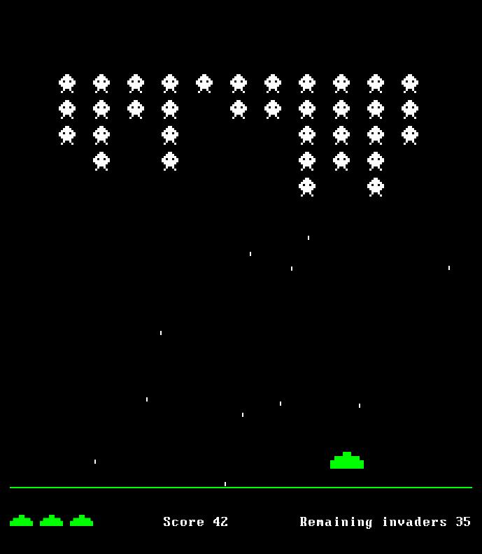
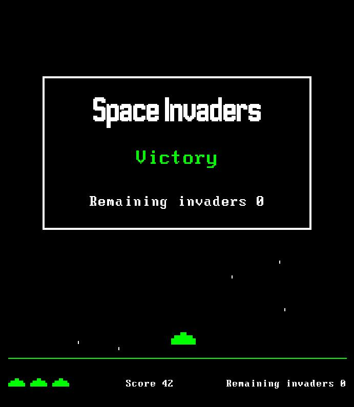

# [Space Invaders](https://en.wikipedia.org/wiki/Space_Invaders)

This project was created as part of an application to the [recurse
center](https://www.recurse.com/). The subject is the following : 

```
Space Invaders

Write a game of Space Invaders that has computer-controller enemies that move left and right
automatically and a human-controlled player that you can move left and right with the arrow keys.

During your interview, you can add the ability to shoot bullets at the enemies and track your score.

```
This [video](https://youtu.be/MU4psw3ccUI?t=26) was used as a reference for coding the game.
It seems to be the original game

<p align="center">
  
  
  <br> <em>View of the game (left) and screen of victory (right)</em>
</p>

## Installation

```sh
$ git clone <this-repo>
$ cd Space-Invaders
$ virtualenv venv # Creation of a virtual environment (only the first time)
$ source venv/bin/activate
$ pip install -r requirements.txt
```
## Usage

```sh
$ cd Space-Invaders
$ source venv/bin/activate
$ python space_invaders.py
```

## Structure

```sh
.
├── img                  # Images illustrating the README
│   └── ...
├── README.md            # This file
├── requirements.txt     # Python requirements
├── src                  # Python files for project
│   ├── fonts            # Fonts used in the game
│   │   └── ...
│   ├── img              # Images used in the game (invaders, player)
│   │   └── ...
│   ├── bullet.py
│   ├── game.py
│   ├── invaders.py
│   ├── player.py
│   └── space_invaders.py # Main file, to launch the fame
├── TODO.md               # List of future improvements to make
└── venv                  # Virtual environement
    └── ...
```

## Languages and tools


 


